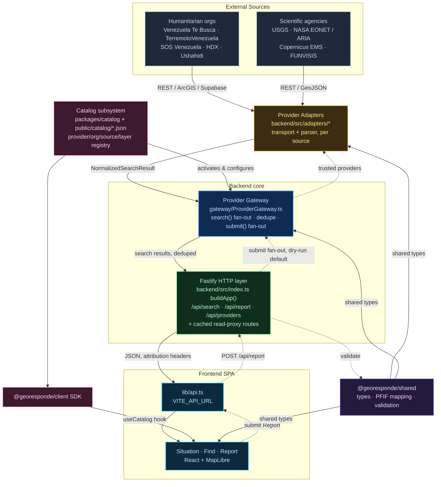

# Architecture

GeoResponde is a TypeScript pnpm monorepo that federates real-time humanitarian and scientific data rather than owning it. Nothing is persisted — every request fans out live to external providers, gets normalized and deduped, and streams straight through to the map.

- ~20 provider adapters
- One central federation gateway
- Fastify API, dual-deployed (Vercel functions or any Node host)
- React + MapLibre SPA
- **Zero persistent storage** — GeoResponde is a federator, not a system of record

Frontend and backend are deployed as two independent Vercel projects, connected only via `VITE_API_URL`. There is no database anywhere in the system.

---

## System topology

A fully rendered architecture digram can be seen [here](architecture_export.html)

Solid arrows are the search / read path. Dashed arrows are the report submission path.



**Legend**

| Color | Component |
|---|---|
| Gray | External source |
| Amber | Provider adapter |
| Blue | Provider Gateway |
| Green | Fastify HTTP layer |
| Pink | Catalog / client SDK |
| Purple | Shared types & validation |
| Sky | Frontend SPA |

---

## Read path, in one line

```
external provider → adapter (parse + normalize) → gateway (fan-out + dedupe)
  → Fastify route (cache + attribution) → frontend hook → map / list UI
```

---

## Component detail

### Provider Adapters

One adapter per upstream system (~20 total). Each implements `BaseAdapter`, handles its own transport (REST, ArcGIS FeatureServer, Supabase PostgREST, Remix Single Fetch), and normalizes responses into shared result types.

```
backend/src/adapters/<provider>/adapter.ts
backend/src/adapters/<provider>/parser.ts
backend/src/adapters/registry.ts
```

- **Upstream:** external provider APIs
- **Downstream:** Provider Gateway

### Provider Gateway

The federation engine. Loads active providers from the catalog, instantiates their adapters, and exposes `search()` (fan-out + cédula-aware dedupe) and `submit()` (fan-out a report by topic, idempotency-keyed, dry-run by default).

```
backend/src/gateway/ProviderGateway.ts
backend/src/gateway/dedupe.ts
backend/src/gateway/idempotency.ts
```

- **Upstream:** Provider Adapters, Catalog subsystem
- **Downstream:** Fastify HTTP layer

### Fastify HTTP Layer

Exposes `/api/search`, `/api/report`, `/api/providers`, plus dedicated cached read-proxy routes for USGS, EONET, FUNVISIS, Copernicus and NASA damage layers — each with its own TTL cache and required attribution headers, degrading gracefully instead of erroring.

```
backend/src/index.ts — buildApp()
backend/api/index.ts — Vercel wrapper
```

- **Upstream:** Provider Gateway
- **Downstream:** Frontend `lib/api.ts`

### Catalog Subsystem

Static, versioned registry of organizations, sources, datasets, layers and providers. Built and validated by a CLI; drives which adapters the Gateway activates and what the frontend can browse.

```
packages/catalog (build/validate CLI)
public/catalog/*.json
packages/client — GeoRespondeClient SDK
```

- **Downstream:** Provider Gateway, Frontend `useCatalog` hook

### @georesponde/shared

Cross-cutting types (`HumanitarianProvider`, `Report`, `NormalizedSearchResult`), report topic/field validation, PFIF export mapping, and country/event registries used by every other package.

```
packages/shared/src
```

- **Downstream:** Adapters, Gateway, Frontend

### Frontend SPA

React + MapLibre app with three surfaces: **Situation** (hazard/earthquake/damage map layers), **Find** (federated person/resource search), **Report** (structured, consent-gated submission form).

```
frontend/src/lib/api.ts
frontend/src/hooks/use*.ts
frontend/src/pages/{Situation,Find,Report}
```

- **Upstream:** Fastify HTTP layer, Client SDK

---

## Key API surface

| Route | Method | Purpose |
|---|---|---|
| `/api/search` | `GET` | Federated search fan-out across search-capable adapters, deduped |
| `/api/report` | `POST` | Validates a report, then fans it out via Gateway `submit()` to trusted providers (dry-run by default) |
| `/api/providers` | `GET` | Lists active providers from the catalog with live adapter status |
| `/api/providers/:id/geojson` | `GET` | GeoJSON layer for a single provider |
| `/api/usgs/earthquakes` | `GET` | Cached read-proxy to USGS earthquake feed |
| `/api/eonet/events` | `GET` | Cached read-proxy to NASA EONET natural events |
| `/api/funvisis/earthquakes` | `GET` | Cached read-proxy to FUNVISIS / SismosVE |
| `/api/damage/copernicus/:product` | `GET` | Cached read-proxy to Copernicus EMS damage products |
| `/api/damage/nasa/dpm` | `GET` | Cached read-proxy to NASA ARIA damage proxy map |

---

## Notes

Sourced by reading the repo directly (adapters, gateway, Fastify routes, catalog build, frontend hooks) — not from docs alone. Frontend and backend are deployed as two independent Vercel projects, connected only via `VITE_API_URL`; no database or persistent store exists in the system.

See also: [`docs/providers.md`](./providers.md) for the provider integration workflow, [`docs/deployment.md`](./deployment.md) for how the two pieces are deployed, and [`knowledge/adr/0001-connector-strategy.md`](../knowledge/adr/0001-connector-strategy.md) for the git-driven connector ADR.
