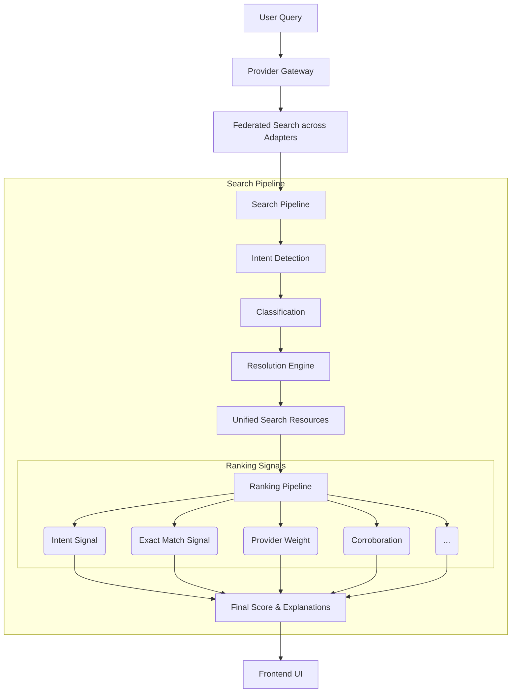
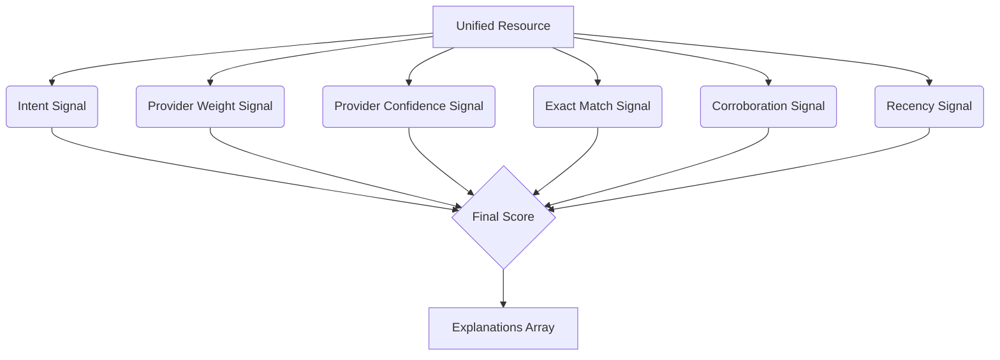

# Search Pipeline Architecture

GeoResponde's Search Pipeline is a modular, provider-agnostic engine that federates data from multiple sources, detects user intent, groups identical entities, and ranks them intelligently using independent signals.

This document serves as the canonical architectural reference for the search subsystem.

## Design Goals

1. **Provider-Agnosticism**: The pipeline should never know about specific provider integrations, API shapes, or catalog nuances. Data is normalized at the edge (Adapter layer) before entering the pipeline.
2. **Modular Ranking**: Search ranking must be composed of independent, highly decoupled signals. Adding a new signal (e.g., semantic search, geographic proximity) should not require changing existing ones.
3. **Progressive Disclosure**: Information must not overwhelm the user. The UI intelligently groups and collapses less relevant categories while auto-expanding the most critical information based on the pipeline's ranking.
4. **Explainable Ranking**: Every ranking adjustment must be tracked. The UI surfaces exactly *why* a resource is prioritized, fostering trust.

## High-Level Architecture

The search flow is orchestrated by the `ProviderGateway`, but all business logic resides in the Search Pipeline.

## Pipeline Stages

### 1. Provider Gateway Orchestration
The `ProviderGateway` acts purely as an orchestrator. It executes `Promise.all` across all active adapters, collects `NormalizedSearchResult` arrays, and passes them to the Search Pipeline. Crucially, the Gateway extracts any necessary provider metadata (like dynamic `rankingWeights`) and injects it into a `RankingContext`. Signals **never** access the provider catalog directly.

### 2. Intent Detection
Using keyword heuristics (and in the future, semantic ML models), the pipeline detects what the user is trying to accomplish (e.g., `FIND_PERSON`, `FIND_SHELTER`, `FIND_HOSPITAL`). Multiple intents can be triggered simultaneously.

### 3. Classification
Results are split into two tracks:
- **Resolution-Eligible**: Entities like `person` that frequently have duplicates and need clustering.
- **Pass-through**: Entities like `shelter` or `building` that can be rendered independently.

### 4. Resolution Engine (Entity Clustering)
Resolution uses a graph-based approach to group duplicates into a `CandidateEntity`:
- Observations form the **Nodes** in a `RelationshipGraph`.
- Modular strategies (e.g., `ExactIdentifierStrategy`) evaluate observation pairs and draw **Edges** if they share a hard identifier (like a Cédula or National ID).
- Connected components are extracted via BFS and collapsed into unified candidates.

### 5. Unified Search Resources
All entities (both resolved candidates and pass-through results) are mapped into a single uniform contract: `UnifiedSearchResource`. This struct carries the entity's type, underlying data, and an initially empty relevance score and explanation array.

### 6. Ranking Pipeline
The Ranking Pipeline executes a suite of independent `SignalEvaluator` objects over every `UnifiedSearchResource`. It calculates a `relevanceScore` based on the sum of all triggered signals. 

#### Signal Independence
Signals are stateless pure functions. They receive the `UnifiedSearchResource` and a `RankingContext` (containing the user's query, parsed intents, and provider weights). Signals evaluate the data and return a `RankingExplanation` if they contribute a positive score. 

### 7. Explainable Ranking
Every time a signal modifies the ranking score, it pushes an explanation. The frontend consumes this array to render transparent badges (e.g., "✓ Supported by 3 providers", "✓ Matches search intent").

### 8. Frontend: Dynamic Grouping & Progressive Disclosure
The frontend (`Find.tsx`) dynamically groups the ranked `UnifiedSearchResource` array by their normalized `entityType`. 
- Group headings dynamically display the type (e.g., "Person (4)", "Hospital (1)").
- Only the group containing the highest-ranked result is auto-expanded.
- Empty groups are intrinsically impossible as grouping occurs dynamically over the populated result set.

## Extension Points

Future contributors can easily enhance the pipeline:
- **New Ranking Signals**: Create a new file in `backend/src/search/signals/`, implement `SignalEvaluator`, and append it to the `ALL_SIGNALS` array in `ranking.ts`.
- **New Resolution Strategies**: Implement `ResolutionStrategy` and register it in `ResolutionEngine.ts`.
- **Semantic Search**: The `Intent Detection` stage can be upgraded from keyword matching to a lightweight embedding model without affecting the rest of the pipeline.

## Architectural Outcome

This PR establishes the Search Pipeline as one of GeoResponde's core infrastructure components.

Future search improvements—including semantic search, geographic relevance, AI-assisted ranking, relationship exploration, additional ranking signals, and new search heuristics—should be implemented as incremental extensions to this pipeline rather than architectural redesigns.
